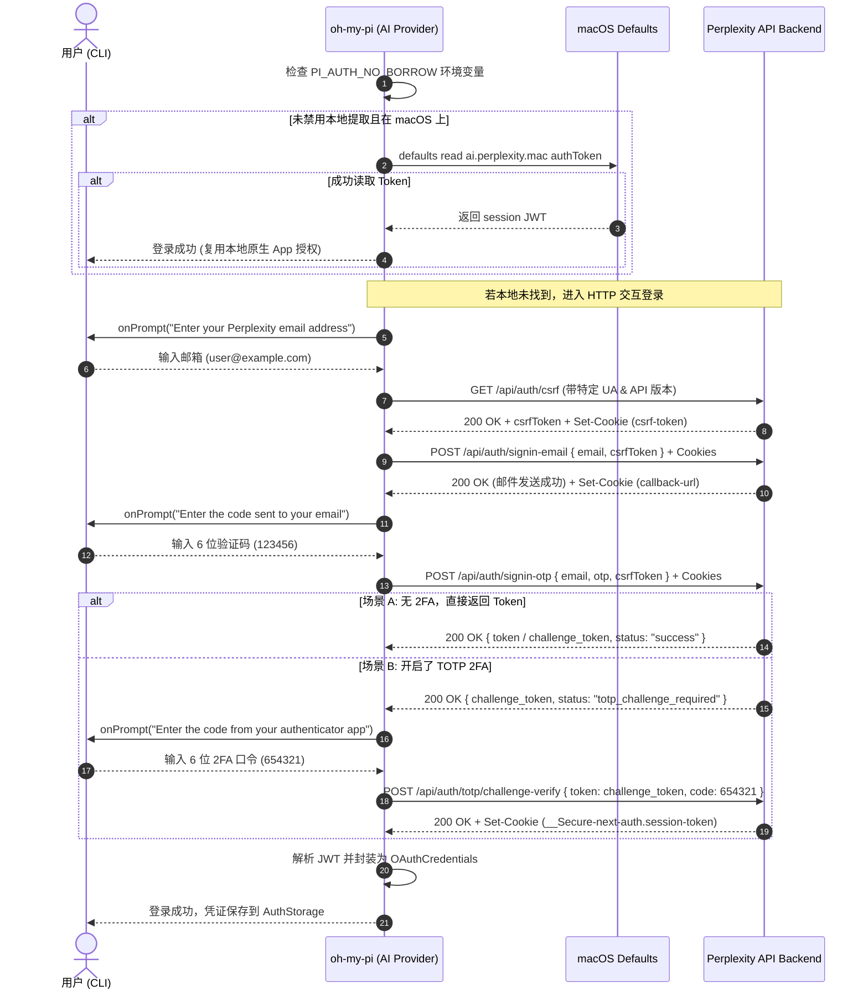

# Perplexity OAuth 登录实现技术细节深度解析

本项目基于对 [oh-my-pi](https://github.com/can1357/oh-my-pi) 代码库的逆向与源码分析，系统梳理了其针对 **Perplexity** 所实现的“OAuth / 账号授权”登录机制、Token 提取逻辑、两步验证（2FA/TOTP）处理、以及如何在后续请求中鉴权调用的完整技术细节。

---

## 目录
1. [架构背景与设计概述](#1-架构背景与设计概述)
2. [登录路径与优先级机制](#2-登录路径与优先级机制)
3. [路径一：macOS 原生客户端 Token 提取（Desktop App Borrowing）](#3-路径一macos-原生客户端-token-提取desktop-app-borrowing)
4. [路径二：HTTP Email OTP + TOTP 2FA 登录流程](#4-路径二http-email-otp--totp-2fa-登录流程)
   - 4.1 请求头与防风控伪装
   - 4.2 Cookie 状态机管理
   - 4.3 步骤 1：获取 NextAuth CSRF Token
   - 4.4 步骤 2：请求邮箱验证码（Sign-in Email）
   - 4.5 步骤 3：验证邮箱验证码（Sign-in OTP）
   - 4.6 步骤 4：TOTP / 身份验证器 2FA 挑战验证
   - 4.7 步骤 5：Token 提取与凭证构造
5. [Token 结构、有效期与刷新机制](#5-token-结构有效期与刷新机制)
6. [在 API / Search 中的鉴权调用机制（关键细节）](#6-在-api--search-中的鉴权调用机制关键细节)
7. [核心代码与时序图](#7-核心代码与时序图)
8. [环境控制变量与配置项](#8-环境控制变量与配置项)

---

## 1. 架构背景与设计概述

Perplexity 官方并没有向普通用户提供标准的 OAuth 2.0 Authorization Code 流程供第三方应用接入。为了实现无需用户手动打开浏览器控制台复制 Cookie 的零门槛/低门槛登录体验，`oh-my-pi` 通过逆向分析 **Perplexity macOS 官方客户端（`ai.perplexity.mac`）** 和 **Web 端 NextAuth 后端接口**，实现了两套全自动/半自动认证通道：

```
                    ┌──────────────────────────────┐
                    │     loginPerplexity(ctrl)    │
                    └──────────────┬───────────────┘
                                   │
                     PI_AUTH_NO_BORROW == 1 ?
                     /                           \
                 [否]                             [是]
                  │                                │
        macOS 平台 (darwin) ?                       │
         /               \                         │
     [是]                 [否]                      │
      │                     │                      │
┌─────▼────────────────┐    │                      │
│ extractFromNativeApp │    │                      │
│ (读取 NSUserDefaults) │    │                      │
└─────┬────────────────┘    │                      │
   Token 有效?              │                      │
   /        \              │                      │
 [是]        [否]           │                      │
  │            └────────────┼──────────────────────┘
  │                         │
  │                 ┌───────▼──────────────┐
  │                 │    httpEmailLogin    │
  │                 │ (Email OTP + TOTP)   │
  │                 └───────┬──────────────┘
  │                         │
┌─▼─────────────────────────▼──────────────────────┐
│            构造 OAuthCredentials 对象             │
│   { access, refresh, expires, email }            │
└──────────────────────────────────────────────────┘
```

---

## 2. 登录路径与优先级机制

登录入口函数定义在 `packages/ai/src/registry/oauth/perplexity.ts` 中的 `loginPerplexity(ctrl: OAuthController)`：

1. **第一优先级（Path 1 - 桌面应用复用）**：
   - 检查环境变量 `PI_AUTH_NO_BORROW`。若未设置，则尝试从 macOS 原生客户端的配置数据库中提取已登录的 Token。
   - 若成功拿到 Token，直接生成凭证并返回，整个过程**秒级完成且无需任何用户交互**。
2. **第二优先级（Path 2 - HTTP 交互式验证码登录）**：
   - 若非 macOS 环境、未安装原生客户端、或设置了 `PI_AUTH_NO_BORROW=1`，则通过 CLI 交互提示用户输入注册邮箱。
   - 调用 Perplexity NextAuth 协议端点发送验证码，提示用户输入 6 位邮箱验证码。
   - 若账号启用了二次验证（TOTP Authenticator），自动进入 2FA 挑战验证环节，提示输入身份验证器动态口令。

---

## 3. 路径一：macOS 原生客户端 Token 提取（Desktop App Borrowing）

### 3.1 技术原理
Perplexity macOS 官方客户端（Bundle ID 为 `ai.perplexity.mac`，基于 Mac Catalyst 架构构建）在用户登录后，将其会话 JWT 存放在当前用户的 `NSUserDefaults`（即 macOS 用户偏好设置 plist 文件）中，键名为 `authToken`，而**没有存放在受隔离保护的 Keychain 中**。

由于 `NSUserDefaults` 的读取权限属于当前操作系统用户（Same-UID），任何同用户权限下运行的命令行工具或进程均可直接通过 macOS 的 `defaults` 命令读取该值。

### 3.2 源码实现 (`packages/ai/src/registry/oauth/perplexity.ts`)

```typescript
const NATIVE_APP_BUNDLE = "ai.perplexity.mac";

async function extractFromNativeApp(): Promise<string | null> {
    if (os.platform() !== "darwin") return null;

    try {
        // 执行 shell 命令: defaults read ai.perplexity.mac authToken
        const result = await $`defaults read ${NATIVE_APP_BUNDLE} authToken`.quiet().nothrow();
        if (result.exitCode !== 0) return null;

        const token = result.text().trim();
        if (!token || token === "(null)") return null;

        return token;
    } catch {
        return null;
    }
}
```

### 3.3 特点
- **零交互**：如果用户已经在 Mac 上安装并登录了 Perplexity 客户端，CLI 工具可直接静默复用其登录态。
- **降级保护**：如果命令执行失败、返回值为空或为 `(null)`，函数安全返回 `null`，无缝降级到交互式登录。

---

## 4. 路径二：HTTP Email OTP + TOTP 2FA 登录流程

当无法复用原生客户端时，系统会执行完整的反向工程 NextAuth 鉴权协议链。

### 4.1 请求头与防风控伪装
为了绕过 Cloudflare Managed Challenge 及 Perplexity 针对标准爬虫的拦截，所有 HTTP 请求均模拟原生客户端的特征：

```typescript
const API_VERSION = "2.18";
const APP_USER_AGENT = "Perplexity/641 CFNetwork/1568 Darwin/25.2.0";
```

关键 Header 配置：
- `User-Agent`: `Perplexity/641 CFNetwork/1568 Darwin/25.2.0` (模拟 iOS/macOS 内部网络库请求)
- `X-App-ApiVersion`: `2.18`
- `Content-Type`: `application/json`

### 4.2 Cookie 状态机管理
Perplexity 登录基于 NextAuth，跨步骤请求必须严格保持并携带前序步骤返回的 Cookie（如 `next-auth.csrf-token`、`__cf_bm`、`next-auth.callback-url` 等）。

`oh-my-pi` 在内部维护了一个 `CookieMap`，封装了自动解析与注入逻辑：
```typescript
function serializeCookies(cookies: CookieMap): string {
    let header = "";
    for (const [name, value] of cookies) {
        header += `${header ? "; " : ""}${name}=${value}`;
    }
    return header;
}

function rememberCookies(cookies: CookieMap, response: Response): void {
    for (const setCookie of response.headers.getSetCookie()) {
        const cookie = Cookie.parse(setCookie);
        if (cookie.isExpired()) {
            cookies.delete(cookie.name);
        } else {
            cookies.set(cookie.name, cookie.value);
        }
    }
}
```

---

### 4.3 步骤 1：获取 NextAuth CSRF Token

- **请求目标**：`GET https://www.perplexity.ai/api/auth/csrf`
- **请求头**：
  - `User-Agent`: `Perplexity/641 CFNetwork/1568 Darwin/25.2.0`
  - `X-App-ApiVersion`: `2.18`
- **响应示例**：
  ```json
  {
    "csrfToken": "a1b2c3d4e5f6..."
  }
  ```
- **关键动作**：
  1. 存储响应中的 Set-Cookie（包含 `next-auth.csrf-token`）。
  2. 提取响应体中的 `csrfToken` 字符串，用于后续所有 POST 操作。

---

### 4.4 步骤 2：请求邮箱验证码（Sign-in Email）

- **交互提示**：提示用户输入邮箱地址（如 `user@example.com`）。
- **请求目标**：`POST https://www.perplexity.ai/api/auth/signin-email`
- **请求头**：
  - `Content-Type`: `application/json`
  - `User-Agent`: `Perplexity/641 CFNetwork/1568 Darwin/25.2.0`
  - `X-App-ApiVersion`: `2.18`
  - `Cookie`: 携带前面获得的全部 cookies
- **请求体（JSON）**：
  ```json
  {
    "email": "user@example.com",
    "csrfToken": "a1b2c3d4e5f6..."
  }
  ```
- **作用**：触发 Perplexity 后端向用户邮箱发送 6 位数字验证码邮件。
- **状态维护**：捕获并更新服务端返回的 `Set-Cookie`（如 `next-auth.callback-url` 等）。

---

### 4.5 步骤 3：验证邮箱验证码（Sign-in OTP）

- **交互提示**：提示用户输入邮箱收到的验证码（如 `123456`）。
- **请求目标**：`POST https://www.perplexity.ai/api/auth/signin-otp`
- **请求头**：同上，带上完整 Cookie。
- **请求体（JSON）**：
  ```json
  {
    "email": "user@example.com",
    "otp": "123456",
    "csrfToken": "a1b2c3d4e5f6..."
  }
  ```
- **响应分支处理**：
  1. **普通无 2FA 账号成功**：
     ```json
     {
       "token": "eyJhbGciOi...",
       "status": "success"
     }
     ```
     或新版接口结构：
     ```json
     {
       "challenge_token": "eyJhbGciOi...",
       "status": "success"
     }
     ```
     直接获取 `token` / `challenge_token` 作为会话凭据。
  2. **开启了 2FA（两步验证）账号**：
     ```json
     {
       "challenge_token": "temp_totp_challenge_token...",
       "status": "totp_challenge_required"
     }
     ```
     此时进入步骤 4 进行二次身份验证。

---

### 4.6 步骤 4：TOTP / 身份验证器 2FA 挑战验证

若服务端返回 `status === "totp_challenge_required"`：

- **交互提示**：提示用户输入 Authenticator App（Google Authenticator / 1Password 等）的 6 位动态口令。
- **请求目标**：`POST https://www.perplexity.ai/api/auth/totp/challenge-verify`
- **请求头**：
  - `Content-Type`: `application/json`
  - `User-Agent`: `Perplexity/641 CFNetwork/1568 Darwin/25.2.0`
  - `X-App-ApiVersion`: `2.18`
  - `Cookie`: 携带完整会话 Cookie
- **请求体（JSON）**：
  ```json
  {
    "token": "temp_totp_challenge_token...",
    "code": "654321"
  }
  ```
- **响应提取**：
  - 若响应体 JSON 带有 `token`，直接使用。
  - 若响应体未直接返回 `token`，则从最新响应的 `Set-Cookie` 中提取会话 Token：
    `cookies.get("__Secure-next-auth.session-token") ?? cookies.get("next-auth.session-token")`

---

### 4.7 步骤 5：Token 提取与凭证构造

无论通过哪种路径获取到最终的 Session Token / JWT，统一调用 `jwtToCredentials(token, email)` 构建标准凭证对象：

```typescript
function jwtToCredentials(jwt: string, email?: string): OAuthCredentials {
    return {
        access: jwt,
        refresh: jwt,
        expires: getJwtExpiry(jwt),
        email,
    };
}
```

---

## 5. Token 结构、有效期与刷新机制

### 5.1 Perplexity Session Token 的特殊性
Perplexity 的 Session Token 通常是 NextAuth 加密的 JWE 或 JWT。大部分情况下，**Token Payload 中并不包含标准的 `exp` 过期时间戳**（因为会话有效性完全由服务端控制）。

### 5.2 过期时间解析策略 (`getJwtExpiry`)
```typescript
const NEVER_EXPIRES = 8.64e15; // JavaScript Date 最大有效安全值 (约 275,760 年)

function getJwtExpiry(token: string): number {
    try {
        const parts = token.split(".");
        if (parts.length !== 3) return NEVER_EXPIRES;
        const payload = parts[1] ?? "";
        const decoded = JSON.parse(atob(payload.replace(/-/g, "+").replace(/_/g, "/")));
        if (typeof decoded?.exp === "number" && Number.isFinite(decoded.exp)) {
            // 如果存在 exp 字段，提前 5 分钟视作过期（安全冗余窗口）
            return decoded.exp * 1000 - 5 * 60_000;
        }
    } catch {
        // 忽略 base64 解码异常
    }
    return NEVER_EXPIRES;
}
```

### 5.3 运行时兜底机制 (`getOAuthApiKey`)
在 `packages/ai/src/registry/oauth/index.ts` 中，当检查 OAuth 凭证是否过期时：
```typescript
if (Date.now() >= creds.expires) {
    if (provider === "perplexity") {
        const jwtExpiry = getPerplexityJwtExpiryMs(creds.access);
        if (jwtExpiry && Date.now() < jwtExpiry) {
            const fallbackCredentials = { ...creds, expires: jwtExpiry };
            return { newCredentials: fallbackCredentials, apiKey: fallbackCredentials.access };
        }
    }
    // 若确认过期则拒绝使用
}
```

---

## 6. 在 API / Search 中的鉴权调用机制（关键细节）

获取到 OAuth Token 后，`oh-my-pi` 是如何利用它进行搜索和模型推理的？这里有一个**非常关键的技术发现**。

### 6.1 核心陷阱：Bearer Header vs Cookie Header
在 `packages/coding-agent/src/web/search/providers/perplexity.ts` 的实现中有明确注释：

> **重要机制**：
> Perplexity 的 `perplexity_ask`（SSE 流式端点）**不识别 `Authorization: Bearer <token>` 请求头**。如果以 Bearer 方式传入，Perplexity 后端会直接忽略，并静默降级为未登录用户的免费 `turbo` 模型，无法使用用户的 Pro/Max 权益（如 Sonar Reasoning Pro、Claude 3.7 Sonar 等）。
>
> **正确做法**：
> 必须将获取到的 OAuth Token 作为 Cookie 传入：
> `Cookie: __Secure-next-auth.session-token=${auth.token}`

### 6.2 SSE Ask 请求参数构造

- **目标端点**：`POST https://www.perplexity.ai/rest/sse/perplexity_ask`
- **请求头**：
  ```http
  Content-Type: application/json
  Accept: text/event-stream
  Origin: https://www.perplexity.ai
  Referer: https://www.perplexity.ai/
  User-Agent: Perplexity/641 CFNetwork/1568 Darwin/25.2.0
  X-Request-ID: <UUID>
  Cookie: __Secure-next-auth.session-token=<OAuth_Session_Token>
  X-App-ApiClient: default
  X-App-ApiVersion: 2.18
  X-Perplexity-Request-Reason: submit
  ```
- **请求体（JSON）**：
  ```json
  {
    "query_str": "搜索内容",
    "params": {
      "query_str": "搜索内容",
      "search_focus": "internet",
      "mode": "copilot",
      "model_preference": "experimental",
      "sources": ["web"],
      "should_ask_for_mcp_tool_confirmation": false,
      "supports_tool_approval_modal": false,
      "force_enable_browser_agent": false,
      "is_local_browser_available": false,
      "is_local_browser_allowed": false
    }
  }
  ```
- **流式响应解析**：
  使用 SSE JSON 流解析器 `readSseJson<PerplexityOAuthStreamEvent>` 读取分块响应，合并 `intended_usage === "ask_text"` 的 Markdown 内容块及附带的网页引用来源（Citations & Sources）。

---

## 7. 核心代码与时序图

### 7.1 完整登录时序图



---

## 8. 环境控制变量与配置项

| 环境变量 | 类型 | 作用与技术影响 |
| :--- | :--- | :--- |
| `PI_AUTH_NO_BORROW` | `string` (`1`) | **禁用原生客户端 Token 借用**。设置后跳过 macOS `defaults` 检查，强制使用 Email OTP 登录。 |
| `PERPLEXITY_COOKIES` | `string` | **直接指定 Cookie 字符串**。优先级高于 OAuth，直接用于 `perplexity_ask` 请求的 `Cookie` Header。 |
| `PERPLEXITY_API_KEY` | `string` | **官方 API 密钥**。走 `api.perplexity.ai` 端点，不走逆向的 consumer 端点。 |
| `PI_PERPLEXITY_MODEL` | `string` | 覆盖消费者订阅模型偏好（默认为 `experimental`，支持 Pro 账号的模型选择）。 |
| `PI_PERPLEXITY_RESPONSES` | `string` (`1`) | API Key 模式下切换使用 Responses 端点而非 Chat Completions 端点。 |

---

## 9. 总结与实现启示

`oh-my-pi` 的 Perplexity OAuth 登录实现展现了极高的工程逆向完成度和细节把控：
1. **多重登录路径设计**：优先通过 macOS 系统本地数据库提取 Token（0秒完成），降级使用邮件 OTP / 2FA 流程，兼顾了极致体验与跨平台可用性。
2. **完整支持 2FA/TOTP 链路**：针对开启了两步验证的安全账号，通过 `challenge_token` + `/api/auth/totp/challenge-verify` 完整闭环。
3. **Cookie 严格持久化与状态机机制**：NextAuth 依赖细致的 Cookie 传递，缺失任何一环均会导致 403 / CSRF 校验失败。
4. **鉴权方式转换洞察**：深入探究了 Perplexity Web 端 SSE 接口的鉴权逻辑，发现必须以 `__Secure-next-auth.session-token` Cookie 注入而非 Bearer Token 传递，成功激活 Pro 账号权限。

---

## 10. 企业 SSO (Single Sign-On) 登录机制与浏览器自动化提取

针对无法通过个人邮箱接收 OTP 验证码的用户（如通过 **Linux Do SSO**、企业 Okta / Google Workspace 组织接入的 Perplexity 企业版 Pro 用户），`oh-my-pi` 和外部自动化工具采用了以下机制：

### 10.1 企业 SSO 授权流程
1. **访问中转 / SSO 入口**：例如 `https://sso.example.com/`。
2. **重定向到 Perplexity 组织 SSO 端点**：
   - URL 格式：`https://www.perplexity.ai/auth/sso/org_<ORGANIZATION_ID>`
   - 例如：`https://www.perplexity.ai/auth/sso/org_example_org_id`
3. **IdP 身份提供商认证**：Perplexity 验证用户在 Linux Do / 企业 IdP 处的身份，并在 NextAuth 回调中生成组织会话。
4. **Cookie 颁发**：
   - 核心会话 Cookie：`__Secure-next-auth.session-token`
   - 组织隔离 Cookie：`__Secure-pplx.session.<org-uuid>`
   - 防护 Cookie：`cf_clearance`、`__cf_bm`

### 10.2 借助 `agent-browser --auto-connect` 的免 OTP 登录与 Token 提取
利用 CDP 协议连接用户已登录真实浏览器的机制：
1. **连接与跳转**：
   ```bash
   agent-browser --auto-connect open https://sso.example.com/
   agent-browser --auto-connect click @e4  # 点击“继续登录”
   ```
2. **提取当前会话 Cookie**：
   ```bash
   agent-browser --auto-connect cookies get --json
   ```
3. **注入到 CLI / API 服务中**：
   获取 `__Secure-next-auth.session-token` 或直接设置环境变量：
   ```bash
   export PERPLEXITY_COOKIES="__Secure-next-auth.session-token=<EXTRACTED_TOKEN>"
   ```
4. **调用验证**：直接携带 Cookie 访问 `https://www.perplexity.ai/rest/sse/perplexity_ask`，即可直接获得企业版 Pro / Max 模型的完整能力。

---

## 11. SSO 登录 vs OTP 登录深度对比 & 凭证刷新机制

### 11.1 SSO 登录与 OTP 登录的核心差异对比

| 维度 | Email OTP 登录方式 | SSO (如 Linux Do / 企业 IdP) 登录方式 |
| :--- | :--- | :--- |
| **认证协议层** | 逆向 NextAuth 邮件验证码协议 (`/api/auth/signin-otp`) | 基于 Web 的 SAML / OIDC 组织 SSO (`/auth/sso/org_<ID>`) |
| **执行环境要求** | 纯命令行 / 无头终端 (Headless)，仅需接收 6 位邮箱验证码 | 需要浏览器渲染环境或通过 CDP (`agent-browser --auto-connect`) 自动复用 |
| **账号与权限类型** | 个人账号 (Personal Pro / Free) | 企业组织工作区 (Enterprise Pro / Team Pool) |
| **生成的凭证形态** | `next-auth.session-token` (个人级 JWT) | `__Secure-next-auth.session-token` + `__Secure-pplx.session.<org-uuid>` (企业级双 Cookie) |
| **风控与验证码** | 依赖邮箱收码，部分安全账号触发 TOTP 2FA | 绕过个人邮箱依赖，由外部 IdP (Linux Do) 统一维护信任链 |

---

### 11.2 SSO 凭证是否需要刷新机制？如何实现？

**结论**：SSO 提取的 Session Token **天然具有 30 天的有效期（`Max-Age=2592000`）**，虽然没有标准 OAuth2 的 `refresh_token` 字符串，但在实际工程中**需要并完全支持会话刷新与保活机制**。

#### 1. 机制一：NextAuth 滚动会话保活（Rolling / Sliding Session）——推荐
Perplexity 后端采用 NextAuth.js 框架。当客户端发起会话查询时，服务端会自动顺延 30 天有效期并重写 Cookie。

- **保活端点**：`GET https://www.perplexity.ai/api/auth/session`
- **请求头**：
  ```http
  Cookie: __Secure-next-auth.session-token=<CURRENT_TOKEN>; cf_clearance=<CF_TOKEN>
  User-Agent: Mozilla/5.0 ...
  Referer: https://www.perplexity.ai/
  ```
- **服务端响应**：
  - 返回 HTTP `200 OK` 及当前组织用户元数据（如 `user.org_role: "MEMBER"`, `payment_tier: "paid"`）。
  - 在响应的 `Set-Cookie` 中返回全新的 `__Secure-next-auth.session-token`，带有 `Max-Age=2592000`（30天）。
- **工程实践**：服务后台设置定时任务（如每 7~14 天），请求一次 `/api/auth/session` 并持久化最新的 `Set-Cookie`，即可实现**凭证长期甚至永久有效**。

#### 2. 机制二：CDP 浏览器自动化静默重刷（失效兜底）
若服务长期离线导致超过 30 天 Cookie 完全失效（请求返回 `401 Unauthorized`）：
- 系统自动触发 `agent-browser --auto-connect`；
- 静默打开 `https://sso.example.com/` 并自动触发 SSO 跳转；
- 浏览器由于已持久化 Linux Do 的 IdP 状态，会在无需人工干预的情况下瞬间重新生成 Perplexity Session Cookie；
- 脚本重新调用 `agent-browser cookies get` 提取最新凭证，完成自愈。

---

## 12. 模仿 oh-my-pi 方式实现 Perplexity SSO Token 刷新机制

### 12.1 SSO 体系中的 `refresh_token` 字段本质
在标准的 OAuth2 协议中，通常在登录时返回独立的 `access_token` 和 `refresh_token` 两个字符串。但在 Perplexity 基于 NextAuth.js 的架构中：
- **无独立 Refresh Token 字段**：NextAuth 采用紧凑的 JWE/JWT Cookie 会话机制。
- **Session Token 身兼双职**：`__Secure-next-auth.session-token` 既充当鉴权调用的 Access Token，又作为向会话接口索取新凭据的 Refresh Token。
- **凭证结构映射**：在 `oh-my-pi` 的 `OAuthCredentials` 接口中，标准做法是将该 Token 同时赋予 `access` 和 `refresh` 字段：
  ```typescript
  {
    access: sessionToken,
    refresh: sessionToken, // 用 sessionToken 作为 refresh 凭据
    expires: expiresMs,
    email: user.email,
    orgId: user.org_uuid,
  }
  ```

---

### 12.2 刷新接口请求规范

- **请求目标**：`GET https://www.perplexity.ai/api/auth/session`
- **请求头配置**：
  ```http
  GET /api/auth/session HTTP/1.1
  Host: www.perplexity.ai
  User-Agent: Perplexity/641 CFNetwork/1568 Darwin/25.2.0
  X-App-ApiClient: default
  X-App-ApiVersion: 2.18
  Cookie: __Secure-next-auth.session-token=<CURRENT_REFRESH_TOKEN>
  Origin: https://www.perplexity.ai
  Referer: https://www.perplexity.ai/
  Accept: */*
  ```

- **服务端响应结构**：
  - **HTTP 状态码**：`200 OK`
  - **响应 JSON Body**：
    ```json
    {
      "user": {
        "id": "00000000-0000-0000-0000-000000000000",
        "name": "Example User",
        "email": "user@example.com",
        "org_role": "MEMBER",
        "org_uuid": "11111111-1111-1111-1111-111111111111",
        "payment_tier": "paid",
        "subscription_status": "active",
        "subscription_tier": "pro"
      },
      "expires": "2026-10-01T05:15:18.523Z"
    }
    ```
  - **响应 Set-Cookie Headers**：
    ```http
    Set-Cookie: __Secure-next-auth.session-token=<NEW_SESSION_TOKEN>; Path=/; Max-Age=2592000; HttpOnly; Secure; SameSite=Lax
    Set-Cookie: __Secure-pplx.session.<org_uuid>=<NEW_ORG_TOKEN>; Path=/; Max-Age=2592000; HttpOnly; Secure; SameSite=Lax
    ```

---

### 12.3 TypeScript 实现代码（完全适配 oh-my-pi 架构）

以下代码可直接集成至 `packages/ai/src/registry/oauth/perplexity.ts` 中，并挂载到 `perplexityProvider.refreshToken`：

```typescript
import { Cookie } from "bun";
import * as AIError from "../../error";
import type { OAuthCredentials } from "./types";

const API_VERSION = "2.18";
const APP_USER_AGENT = "Perplexity/641 CFNetwork/1568 Darwin/25.2.0";

/**
 * 模仿 oh-my-pi 体系的 Perplexity Token 刷新函数
 */
export async function refreshPerplexityToken(
    credentials: OAuthCredentials,
    signal?: AbortSignal,
): Promise<OAuthCredentials> {
    const token = credentials.refresh || credentials.access;
    if (!token) {
        throw new AIError.OAuthError("Perplexity refresh token is missing", {
            kind: "token-refresh",
            provider: "perplexity",
        });
    }

    const response = await fetch("https://www.perplexity.ai/api/auth/session", {
        method: "GET",
        headers: {
            "User-Agent": APP_USER_AGENT,
            "X-App-ApiVersion": API_VERSION,
            "X-App-ApiClient": "default",
            "Cookie": `__Secure-next-auth.session-token=${token}`,
            "Origin": "https://www.perplexity.ai",
            "Referer": "https://www.perplexity.ai/",
        },
        signal,
    });

    if (!response.ok) {
        throw new AIError.OAuthError(`Perplexity token refresh failed: ${response.status}`, {
            kind: "token-refresh",
            provider: "perplexity",
            status: response.status,
        });
    }

    // 1. 从 Set-Cookie 中提取服务端轮换后的全新 Session Token
    const setCookies = response.headers.getSetCookie();
    let newSessionToken: string | undefined;
    for (const cookieStr of setCookies) {
        const parsed = Cookie.parse(cookieStr);
        if (parsed.name === "__Secure-next-auth.session-token" || parsed.name === "next-auth.session-token") {
            newSessionToken = parsed.value;
            break;
        }
    }

    // 若服务端未回写新 Cookie 则沿用当前有效 Token
    newSessionToken = newSessionToken || token;

    // 2. 解析 Session 数据
    const sessionData = (await response.json()) as {
        expires?: string;
        user?: {
            id?: string;
            name?: string;
            email?: string;
            org_uuid?: string;
            subscription_tier?: string;
        };
    };

    // 3. 计算过期时间（预留 5 分钟安全缓冲）
    const expiresMs = sessionData.expires
        ? new Date(sessionData.expires).getTime() - 5 * 60_000
        : Date.now() + 30 * 86400 * 1000;

    return {
        access: newSessionToken,
        refresh: newSessionToken,
        expires: expiresMs,
        email: sessionData.user?.email || credentials.email,
        accountId: sessionData.user?.id,
        orgId: sessionData.user?.org_uuid,
    };
}
```

---

### 12.4 Python 客户端保活与刷新实现

对于在 Python 或其它微服务（如 search2api）中部署的场景：

```python
import httpx
from datetime import datetime, timezone


class PerplexitySessionManager:
    def __init__(self, session_token: str, cf_clearance: str = ""):
        self.session_token = session_token
        self.cf_clearance = cf_clearance
        self.user_info = {}
        self.expires_at = None

    def refresh(self) -> str:
        cookies = [f"__Secure-next-auth.session-token={self.session_token}"]
        if self.cf_clearance:
            cookies.append(f"cf_clearance={self.cf_clearance}")

        headers = {
            "User-Agent": "Perplexity/641 CFNetwork/1568 Darwin/25.2.0",
            "X-App-ApiClient": "default",
            "X-App-ApiVersion": "2.18",
            "Cookie": "; ".join(cookies),
            "Origin": "https://www.perplexity.ai",
            "Referer": "https://www.perplexity.ai/",
            "Accept": "*/*",
        }

        with httpx.Client(timeout=10) as client:
            res = client.get("https://www.perplexity.ai/api/auth/session", headers=headers)
            if res.status_code != 200:
                raise RuntimeError(f"Refresh failed ({res.status_code}): {res.text}")

            # 从 Set-Cookie 提取刷新的 session-token
            for sc in res.headers.get_list("set-cookie"):
                if "__Secure-next-auth.session-token=" in sc:
                    self.session_token = sc.split("__Secure-next-auth.session-token=")[1].split(
                        ";"
                    )[0]

            data = res.json()
            self.user_info = data.get("user", {})
            if "expires" in data:
                self.expires_at = data["expires"]

            return self.session_token
```

---

## 13. Perplexity Pro 模型指定机制与内部键映射 (Model Preference Mapping)

### 13.1 机制原理
在调用 `https://www.perplexity.ai/rest/sse/perplexity_ask` 时，请求体中的 `params.model_preference` 字段用于指定底层推理大模型。

**注意**：
- 只有携带有效 Pro 会话 Cookie（`__Secure-next-auth.session-token`）时，自定义 `model_preference` 才会生效并触发指定模型。
- 若传入未知或非法的模型字符串，Perplexity 后端会静默忽略并不返回响应（或降级为默认模型）。

---

### 13.2 官方 Web 端与底层 API 键映射对照表

经深度逆向与实机调用验证，当前 Perplexity 支持的全部有效模型键如下：

| 用户友好别名 (Alias) | Perplexity 内部键 (`model_preference`) | 实际调用大模型与模式 | 响应返回 `display_model` |
| :--- | :--- | :--- | :--- |
| `experimental` / `best` | `experimental` | **最佳可用** (Perplexity 智能优选) | `experimental` |
| `claude-3-7-sonnet` / `claude` | `claude50sonnet` | **Claude Sonnet 5** (Anthropic) | `claude50sonnet` |
| `gpt-5.6` / `gpt-4o` | `gpt56_terra` | **GPT-5.6 Terra** (OpenAI) | `gpt56_terra` |
| `grok-4.6` / `grok` | `grok46low` | **Grok 4.6** (xAI 深度思考推理) | `grok46low` |
| `gemini-3.7-flash` / `gemini` | `gemini37flash` | **Gemini 3.7 Flash** (Google) | `gemini37flash` |
| `glm-5.3` / `glm` | `glm_5_3_thinking` | **GLM 5.3** (智谱 深度思考推理) | `glm_5_3_thinking` |
| `nemotron-3-ultra` / `nemotron` | `nv_nemotron_3_ultra` | **Nemotron 3 Ultra** (NVIDIA 深度思考) | `nv_nemotron_3_ultra` |
| `sonar-pro` / `sonar` | `pplx_pro` | **Sonar 2 / Pro** (Perplexity 自研) | `pplx_pro` |
| `turbo` / `fast` | `turbo` | **Perplexity Turbo** (免费基础快搜) | `turbo` |

---

### 13.3 请求参数示例

```json
{
  "query_str": "分析 2026 年大模型前沿发展",
  "params": {
    "query_str": "分析 2026 年大模型前沿发展",
    "search_focus": "internet",
    "mode": "copilot",
    "model_preference": "claude50sonnet",
    "sources": ["web"],
    "should_ask_for_mcp_tool_confirmation": false,
    "supports_tool_approval_modal": false,
    "force_enable_browser_agent": false,
    "is_local_browser_available": false,
    "is_local_browser_allowed": false
  }
}
```

---

## 14. Perplexity 模型列表加载机制解析 (Model Discovery Architecture)

经过对 Perplexity Web SPA 前端与网络请求的全面排查，Perplexity 的模型列表加载具有以下特定的工程架构特征：

### 14.1 核心发现：无独立 `/api/models` 端点
Perplexity **没有向前端提供独立的 `/api/models` 或 `/rest/models` HTTP 查询端点**（请求该路径均返回 403 路由未命中）。

模型列表的加载与呈现是由以下三层机制协同完成的：

```
┌────────────────────────────────────────────────────────┐
│  1. 前端 SPA JS Bundle (静态模型定义与元数据常量表)      │
│     - 包含显示名称、厂商、图标、支持的模式(base/reasoning)  │
└──────────────────────────┬─────────────────────────────┘
                           │
┌──────────────────────────▼─────────────────────────────┐
│  2. Eppo Feature Flags 实验分发 (服务端动态权限开关)     │
│     - 校验用户 Session (Pro/Enterprise vs Free)        │
│     - 动态决定当前账号可用的模型子集与灰度功能            │
└──────────────────────────┬─────────────────────────────┘
                           │
┌──────────────────────────▼─────────────────────────────┐
│  3. 浏览器 LocalStorage (用户偏好本地持久化)              │
│     - preferredSearchModels-v1 (当前激活模型)          │
│     - modelOptionPreferences (每个模型的思考模式配置)   │
└──────────────────────────┬─────────────────────────────┘
                           │ 组装请求
┌──────────────────────────▼─────────────────────────────┐
│  4. POST /rest/sse/perplexity_ask                     │
│     params.model_preference = "<INTERNAL_MODEL_KEY>"  │
└────────────────────────────────────────────────────────┘
```

---

### 14.2 LocalStorage 提取到的完整模型配置表

在浏览器 `localStorage` 中提取的 `pplx.local-user-settings.modelOptionPreferences` 与 UI DOM 结构中完整的模型字典如下：

```json
{
  "pplx_pro": "base",              // Sonar 2 / Pro (Perplexity 官方自研旗舰)
  "gpt56_terra": "base",           // GPT-5.6 Terra (OpenAI 基础模式)
  "claude50sonnet": "reasoning",   // Claude Sonnet 5 (Anthropic 思考模式)
  "grok46low": "reasoning",        // Grok 4.6 (xAI 深度思考)
  "gemini37flash": "reasoning",    // Gemini 3.7 Flash (Google 思考模式)
  "glm_5_3_thinking": "reasoning", // GLM 5.3 (智谱 深度思考)
  "nv_nemotron_3_ultra": "reasoning", // Nemotron 3 Ultra (NVIDIA 深度思考)
  "experimental": "base",          // 最佳可用 (自动智能路由)
  "turbo": "base"                  // Perplexity Turbo (免费极速模式)
}
```

---

### 14.3 对 Search2API 服务的启示与设计实现
由于服务端不暴露动态模型查询 API，外部转接服务（Search2API）的最佳实践是：
1. 在服务端静态维护与官方完全同步的 `MODEL_ALIASES` 映射表与 `/v1/models` 端点。
2. 允许客户端直接传入主流别名（如 `claude-3-7-sonnet`, `gpt-5.6`, `grok-4.6`, `gemini-3.7-flash` 等）。
3. 由服务端在组装 `perplexity_ask` 请求时，自动映射转换为 Perplexity 后端实际认可的内部 Key。

---

## 15. 补充普通账号模型清单与全量大模型总表 (Complete Model Matrix)

通过对普通个人账号在浏览器中的实时提取与参数验证，我们进一步发掘并补充了 **Moonshot Kimi、智谱 GLM 历史版本、Gemini 高规格推理** 等多款模型。

### 15.1 全量模型支持矩阵

| 模型分类 | 用户常用别名 (CLI / API 别名) | Perplexity 内部 Key (`model_preference`) | 运行模式 | 厂商与说明 |
| :--- | :--- | :--- | :--- | :--- |
| **智能优选** | `experimental` / `best` / `auto` | `experimental` | `base` | 官方默认，自动挑选最佳模型 |
| **Anthropic** | `claude-3-7-sonnet` / `claude` | `claude50sonnet` | `reasoning` | **Claude Sonnet 5** (正在思考) |
| | `claude-opus-5` | `claude50opus` | `reasoning` | **Claude Opus 5** (Max 专属) |
| **OpenAI** | `gpt-5.6` / `gpt-4o` | `gpt56_terra` | `base` | **GPT-5.6 Terra** (默认模式) |
| | `gpt-5.6-sol` | `gpt56_sol` | `reasoning` | **GPT-5.6 Sol** (Max 专属) |
| **xAI** | `grok-4.6` / `grok` | `grok46low` | `reasoning` | **Grok 4.6** (深度思考) |
| **Google** | `gemini-3.7-flash` / `gemini` | `gemini37flash` | `reasoning` | **Gemini 3.7 Flash** (正在思考) |
| | `gemini-3.1-pro` | `gemini31pro_high` | `reasoning` | **Gemini 3.1 Pro High** (高算力) |
| **智谱 AI** | `glm-5.3` / `glm` | `glm_5_3_thinking` | `reasoning` | **GLM 5.3** (最新版 深度思考) |
| | `glm-5.2` | `glm_5_2` | `reasoning` | **GLM 5.2** (经典版 深度思考) |
| **月之暗面** | `kimi-k3` / `kimi` | `kimik3thinking` | `reasoning` | **Kimi K3** (US-based 深度思考) |
| | `kimi-k2.6` | `kimik26instant` | `base` | **Kimi K2.6** (极速版) |
| **NVIDIA** | `nemotron-3-ultra` / `nemotron` | `nv_nemotron_3_ultra` | `reasoning` | **Nemotron 3 Ultra** (深度思考) |
| **官方自研** | `sonar-pro` / `sonar` | `pplx_pro` | `base` | **Sonar 2 / Pro** (旗舰快搜) |
| **免费基础** | `turbo` / `fast` | `turbo` | `base` | **Perplexity Turbo** (免费轻量) |
